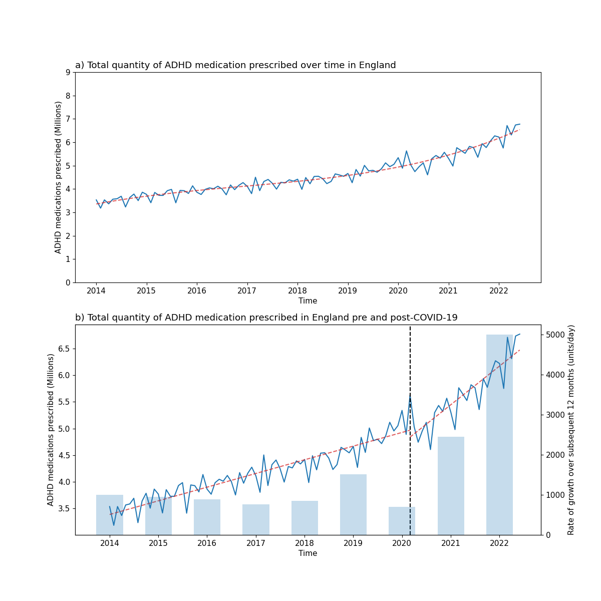
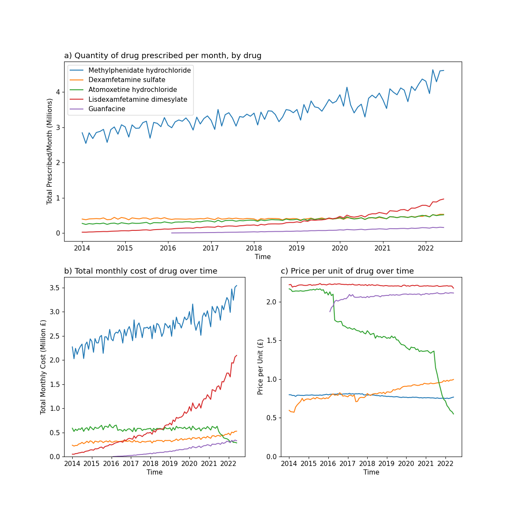

# Modeling symptoms of attention deficit hyperactivity disorder (ADHD) and improving its diagnosis using machine learning approaches.
## Introduction

This project was my dissertation for my MSc Computer Science course at the University of Bath. I chose to pursue this project to combine my experience working with machine learning models with my background in biological sciences.\

I've uploaded the full work here, but will **very** briefly summarise the project below. Unfortunately, none of the raw data can be included in this repository due to the limited use of the ABCD dataset. Access to the dataset can be 
requested through the [National Institute of Mental Health Data Archive (NDA)](https://nda.nih.gov/abcd/).

## Abstract

This dissertation applies a data-driven approach to address current challenges in the treatment and diagnosis of attention deficit hyperactivity disorder (ADHD). In terms of treatment, the English 
Prescribing Dataset to observe the trends in ADHD prescriptions over time. One of the interesting aspects is to observe the prevalence of ADHD regionally across England, and correlate this with various 
socioeconomic metrics (e.g. life expectancy, dispensable income, wellbeing). Then these findings are used to suggest changes to public health policy that have the potential to improve the efficiency of 
ADHD diagnosis and treatment. During this exploration, a need for more accessible diagnostic tools for ADHD is observed. To address this aspect, behavioural data from the ABCD study (of adolescents) 
is utilised, and three machine learning models (logistic regression, SVM, and random forest classifier) are developed. These models made remarkable predictions about ADHD diagnosis above the level of 
chance (AUC = 0.7715). Inability to multitask was identified as the most potent predictor of ADHD, despite not being present on the diagnostic criteria for ADHD. Given further refinement, this model 
could be used as a tool to automate screening for ADHD. 

## Overview

This project is formed of two major segments:
1. An analysis of ADHD medication prescibing trends across England between 2014 and 2022
2. A comparison of classification models for the diagnosis of ADHD from behavioural data

### Prescribing Trends

This section was intended to identify trends that could shed some light on the factors that affect the diagnosis and treatment of ADHD, with the idea being that it would highlight the opportunities to improve the current process.\
\
Firstly, the NHS prescribing dataset was used to identify the number of ADHD prescriptions in a given month (June 2022). For each region across England, the correlation between rate of ADHD and a number of other socioeconomic factors (obtained from ONS datasets) was calculated.

|Variable |Description|
|---|---|
|icb_name |Integrated Care Board Name|
|count_adhd |The total quantity of ADHD medication prescribed|
|non_adhd |The total quantity of medication prescribed|
|percent_total |The percentage of total prescribed medication that was for ADHD|
|number_of_patients |Number of patients assigned to practices in a given ICB|
|adhd_per_pop |Quantity of ADHD medication prescribed standardised for population|
|GDHI/head |Gross Disposable Household Income per person|
|unemployment |Unemployment Rate|
|f_life_expectancy |Average Female Life Expectancy|
|m_life_expectancy |Average Male Life Expectancy|
|avg_life_expectancy |Average Overall Life Expectancy|
|anxiety |On a scale where 0 is “not at all anxious” and 10 is “completely anxious”, overall, how anxious did you feel yesterday? (0-10) |
|happiness |Overall, how happy did you feel yesterday? (0-10)|
|life_satisfaction |Overall, how satisfied are you with your life nowadays? (0-10)|
|worthwhile |Overall, to what extent do you feel that the things you do in your life are worthwhile? (0-10)|

The factors were visualised on a map using Tableau, shown here:

Following this, I investigated the overall prescribing of ADHD medications over time in England, looking at the resulting cost to the NHS. From this, I drew conclusions about how to reduce the financial burden of ADHD on the NHS, as well as noting the impact of COVID-19 on the
prescribing of ADHD medication:

|Effect of COVID-19|Cost and Quantity of Prescriptions|
|---|---|
|||

### ADHD Modelling

The Adolescent Behavioural and Cognitive Development study is a wide-spanning study that collects a huge variety of behavioural, physiological, and cognitive data from a group of adolescents. My plan was to use the behavioural data to train a classification model that could predict
whether an individual had ADHD purely based on easily collectible, non-intrusive, behavioural testing. This would be an indicator to parents that they should see a specialist psychiatrist for further consultation.\
\
I collated a few different questionnaires concerning behaviour to find the questions which were most predictive of ADHD status using a logistic regression model. The top five features are shown below, and are factors commonly associated with ADHD as expected:

|Rank |Statement |Odds Ratio|
|:---:|:---|---:|
|1 |Is good at keeping track of several different things that are happening around her/him |0.645|
|2 |Finds it easy to really concentrate on a problem |0.770|
|3 |Pays close attention when someone tells her/him how to do something |0.789|
|4 |Usually finishes her/his homework before it's due |0.824|
|5 |Is usually able to stick with his/her plans and goals |0.830|

Based on these features, I tested three models - logistic regression, decision forest, and SVM. The models performed reasonably well, especially the SVM model:

|Model |Accuracy |Precision |Recall |F1 Score |AUC|
|:---|---:|---:|---:|---:|---:|
Logistic Regression |0.7025 |0.2634 |0.8016 |0.3965 |0.7451|
SVM |0.6918 |0.2722 |0.8770 |0.4017 |0.7715|
Decision Forest |0.8786 |0.0456 |0.0238 |0.5455 |0.5105|
